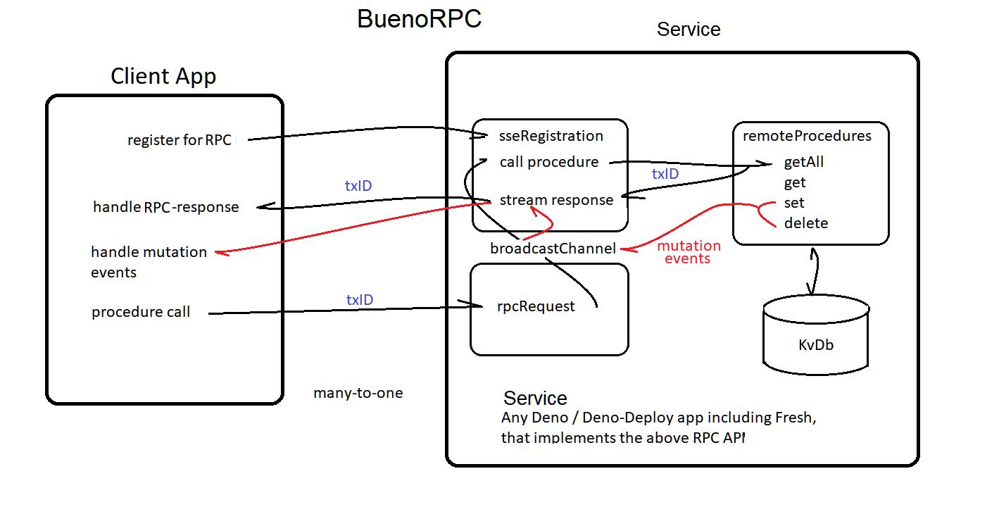

# Bueno-RPC
Remote Procedure Calls via Sever Sent Events   


## Early-days - WIP

This is an example **Deno-Deploy** kvDb-donor for accessing data remotely.   
We use a simple SSE-RPC service to fetch all DenoKv-db-rows.    
The TreeClient app will deconstruct all kvKeys for viewing in a DOM Treeview.  

SEE: Client-app https://github.com/nhrones/KvRPC_TreeClient

## Note: 
you can run this example service with:    
```
deno run -A --unstable server.ts    
```
Then in the TreeClient app (above), select **localhost Example** in the dropdown.    

This early test simply fetches all rows from a DenoKv-DB.    
The service is capable of allowing a client to perform full remote CRUD on the remote DB.   

## See:  **./sseRegistration.ts** 
  - line-26 - registerClient(req: Request)
  - line-46 - switch (procedure)
    - line-91 - case 'GETALL': 


## The Provided Fresh API
The folder **./Fresh-API/SSERPC**, contains all files required to turn any Fresh app into an SSE-RPC DB-donor service. Any DenoKv found in the Fresh app will be accessible to any SSE-RPC remote client.

To enable SSE-RPC in a Fresh app, you simply paste the **SSERPC** folder into your ./routes/ folder.
If the Fresh app has no Kv-data, a simple example dataset will be inserted on the first call.  
For more details see: _./Fresh-API/readme.md/_